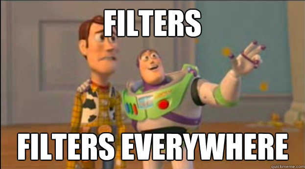
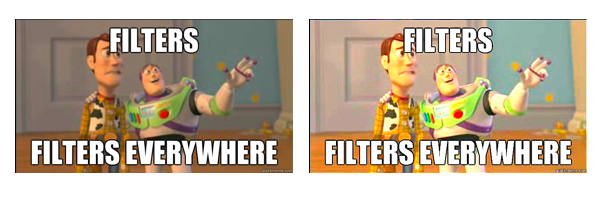

## filterizePy
This is a comprehensive meme generation package based in Python.

**Date:** 2019-02-05

**License:** [MIT](https://opensource.org/licenses/MIT)

#### Authors

|Contributors |Jack Yang| Akansha Vashisth |Chao Wang|
|---|---|---|----|
|github handle||[akanshaVashisth](https://github.com/akanshaVashisth)|[@chaomander2018](https://github.com/chaomander2018)|

### Overview

This a Collaborative Software Development Project in which we will be working on three image processing filters using convolutions.

### Functions

- #### Green Color Filter
This green color filter converts the original image to a green scaled image.
Please see the original image and processed image below.

- #### Sharpen Filter
This sharpen filter function will use convolution to convert the original image to a sharpened image.

- #### Mirror Filter
This mirror filter function will use convolution to convert the original image to a mirrored image i.e. the left side of the image will be tranformed into the right side and the right side of the original image will be transformed into the left side.

## Value Proposition in Python Ecosystems

## Summary

This package is designed for users to apply different filters on the any image.

## Pack Dependencies:
None

## Reference:
Image Source: [tiffen.com](https://tiffen.com/wp-content/uploads/2016/03/Graduated-ND-Yosemite.jpg)
